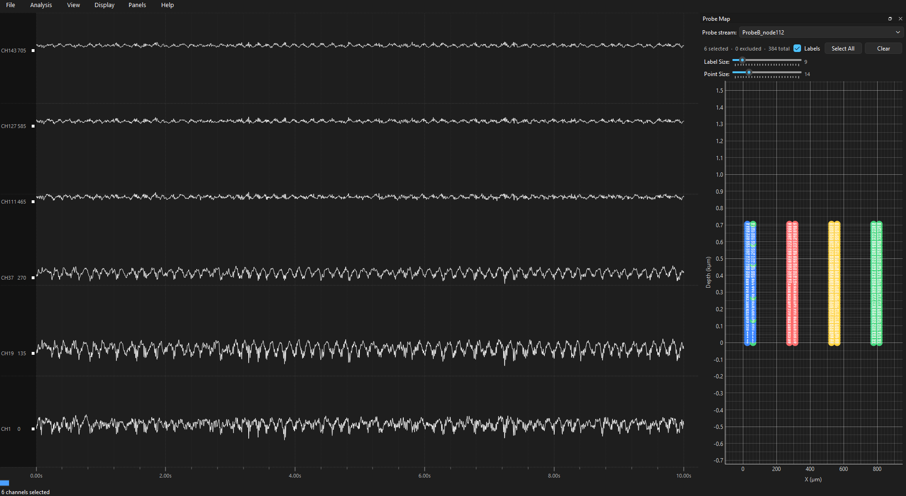
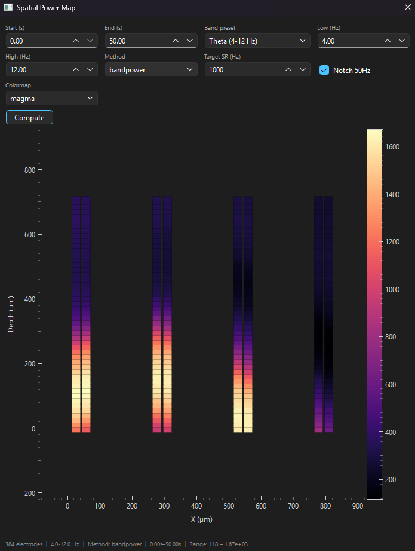
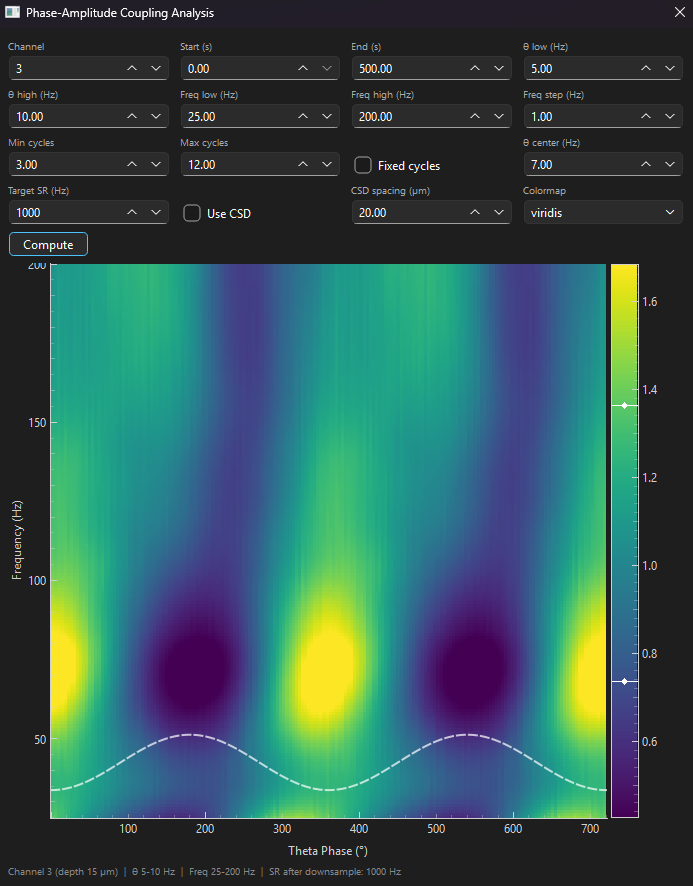

# NeuroPyxels

**NeuroPyxels** is a Python-based graphical interface for visualization and analysis of electrophysiological recordings, with a focus on **Neuropixels** data.

The application provides an interactive environment for exploring neural signals, selecting channels, inspecting oscillatory activity, and performing several commonly used electrophysiological analyses.

---

## Features

- Interactive Neuropixels probe map
- Multi-channel neural trace visualization
- Channel selection and depth-based sorting
- Adjustable trace gain and scaling
- Bandpass, low-pass, high-pass, notch, and detrending filters
- Timestamp-aware navigation
- Interactive spectrogram
- Phase-amplitude coupling analysis
- Spatial power mapping
- Ripple detection
- Theta epoch detection
- Interactive visualization and editing of detected theta epochs
- Export of detected theta epochs to CSV
- Customizable trace and background display
- Keyboard shortcuts for navigation and visualization

---

## Screenshots

### Main interface



The main interface combines the Neuropixels probe map, neural traces, channel selection, navigation, filtering, and display controls in a single workspace.

### Spatial power map



The spatial power map allows neural power to be visualized across the probe according to recording depth and channel location.

### Phase-amplitude coupling



The phase-amplitude coupling analysis provides a comodulogram for investigating interactions between low-frequency phase and higher-frequency amplitude.

### Theta epoch detection


Theta epochs can be detected using configurable frequency bands and detection criteria. Detected epochs can be inspected and manually adjusted before exporting the results.

---

## Installation

### Requirements

NeuroPyxels currently requires:

- Python 3.12
- NumPy
- SciPy
- Matplotlib
- PyQt6

The complete Python environment can be reproduced using the included `requirements.txt`.

### 1. Clone the repository

```bash
git clone https://github.com/RobsonSchefferTeixeira/neuropyxels.git
cd neuropyxels
```

### 2. Create the Conda environment

Using Conda is recommended:

```bash
conda create -n neuropyxels python=3.12
conda activate neuropyxels
```

### 3. Install the dependencies

```bash
pip install -r requirements.txt
```

---

## Running NeuroPyxels

After activating the environment:

```bash
python main_window.py
```

The main application window will open and you can load your recording data from the **File** menu.

---

## Input Data

NeuroPyxels is designed primarily for electrophysiological recordings acquired with Neuropixels probes.

The current workflow supports loading:

- `settings.xml`
- `continuous.dat`
- `timestamps.npy`

These files can be loaded independently from the **File** menu.

The application uses the recording metadata to determine the sampling rate and channel configuration and provides the corresponding signals through the trace visualization interface.

---

## Main Interface

The main window is divided into several components:

### Probe Map

The probe map provides an interactive representation of the Neuropixels probe. Channels can be selected directly from the probe geometry.

### Trace View

Selected channels are displayed as neural traces. The trace view supports:

- Channel selection
- Depth sorting
- Gain adjustment
- Automatic or fixed scaling
- Time navigation
- Zooming
- Signal filtering
- Detrending
- Notch filtering

### Spectrogram

The spectrogram provides a frequency-domain representation of the selected signal over time.

The display can be enabled from the **View** menu and configured using the spectrogram controls.

---

## Analysis

NeuroPyxels currently provides several analysis tools accessible from the **Analysis** menu.

### Phase-Amplitude Coupling

The phase-amplitude coupling tool calculates and displays a comodulogram showing the relationship between the phase of lower-frequency oscillations and the amplitude of higher-frequency oscillations.

This can be useful for investigating cross-frequency interactions in neural recordings.

### Spatial Power Map

The spatial power map displays signal power across the probe, allowing frequency-specific activity to be compared across recording depths.

### Ripple Detection

Ripple detection identifies candidate high-frequency ripple events using configurable detection parameters.

Detected events can be visualized together with the neural traces.

### Theta Epoch Detection

Theta epoch detection identifies periods of elevated theta activity based on the relationship between theta and delta power.

Detection parameters include:

- Theta frequency range
- Delta frequency range
- Theta/delta power ratio threshold
- Minimum epoch duration
- Merge gap

Detected epochs can be inspected in the trace view, manually modified, merged, or deleted before exporting the final results.

---

## Export

Detected theta epochs can be exported as a CSV file for further analysis.

The exported data include information such as:

- Channel
- Start time
- End time
- Duration
- Mean theta/delta ratio
- Peak theta/delta ratio
- Theta power

---

## Project Structure

The project is organized into separate modules for the graphical interface, signal visualization, detection algorithms, and analysis tools.

```text
neuropyxels/
│
├── docs/
│   └── images/
│       ├── main_interface.png
│       ├── spatial_power_map.png
│       ├── phase_amplitude_coupling.png
│       └── theta_epochs_detection.png
│
├── main_window.py
├── trace_view.py
├── neural_trace_view.py
├── probe_map.py
│
├── ripple_detector.py
├── ripple_dialog.py
├── ripple_trace_view.py
│
├── theta_epoch_detector.py
├── theta_epoch_dialog.py
├── theta_epoch_trace_view.py
├── theta_epoch_export.py
│
├── requirements.txt
└── README.md
```

---

## Development

Create and activate the development environment:

```bash
conda activate neuropyxels
```

After making changes:

```bash
git add .
git commit -m "Describe the changes"
git push
```

---

## License

NeuroPyxels is distributed under the **MIT License**.

See [`LICENSE`](LICENSE) for the full license text.

---

## Status

NeuroPyxels is an active research-oriented project under development. Features and analysis tools are continuously being expanded as new electrophysiological analysis workflows are incorporated.