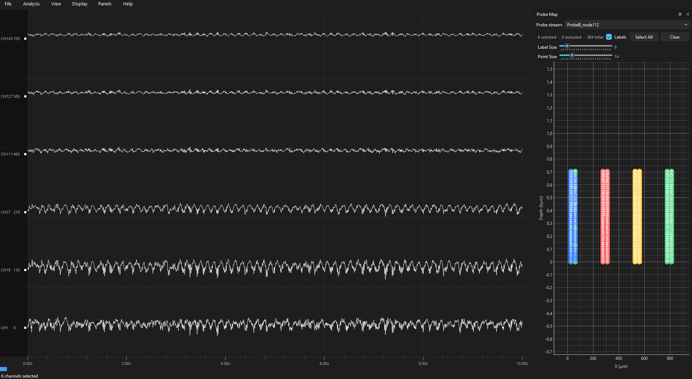
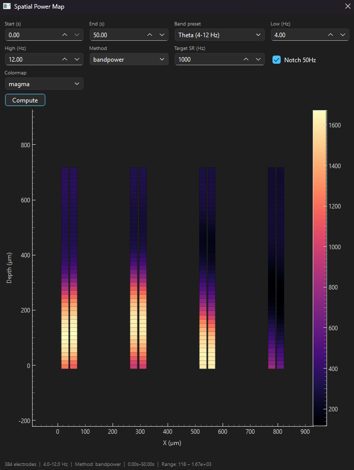
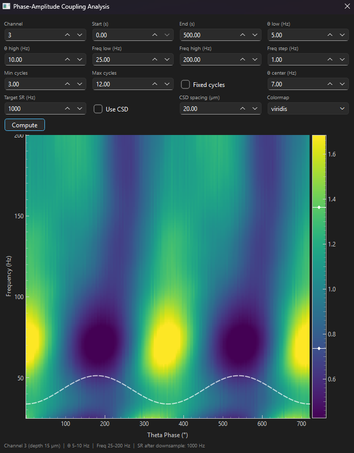
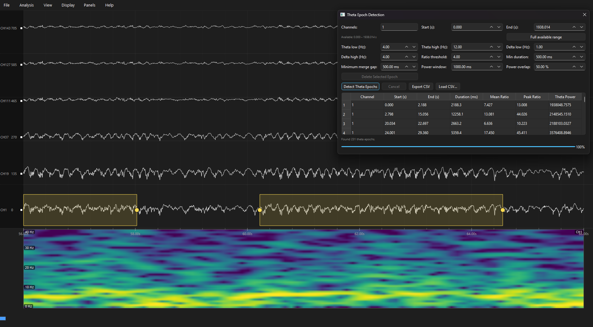

# NeuroPyxels

**NeuroPyxels** is a Python-based graphical interface for visualization and analysis of electrophysiological recordings, with a focus on **Neuropixels** data.

The application provides an interactive environment for exploring neural signals, selecting channels, inspecting oscillatory activity, and performing several commonly used electrophysiological analyses. It is designed to be self-contained: a probe map, a multi-channel trace viewer, and analysis tools all live in one window, so you can go from a raw `continuous.dat` to a phase-amplitude comodulogram without leaving the app.

---

## Features

### Visualization

- Interactive Neuropixels probe map with per-channel selection
- Multi-channel neural trace viewer
- Depth-based channel sorting
- Adjustable gain, auto-scaling, and fixed-scale mode
- Per-channel signal display: raw, filtered, or Current Source Density (CSD), each with independent gain
- Rejected-channel list (Kilosort-style), removes channels from the map, the trace view, and downstream analyses
- Interactive spectrogram with log/linear axes and adjustable frequency band
- Customizable trace, background, and grid colors

### Filtering

- Global bandpass, low-pass, high-pass, notch, and detrend
- Per-channel filter overrides independent of the global settings
- Per-channel CSD with configurable neighbor distance and band

### Analysis

- Phase-amplitude coupling (comodulogram)
- Spatial power map (frequency-band power across the probe)
- Power spectral density (PSD) with Welch or periodogram method
- Sharp-wave ripple detection with dual-threshold envelope detection
- Ripple-triggered average (RTA) rendered as glyphs on the probe geometry
- Theta epoch detection with configurable power-ratio criteria
- Interactive editing of detected theta epochs and ripples (drag, merge, split, delete, add)

### Sorted-spike integration

- Load Kilosort4 / Phy output folders
- Spike raster overlay on the trace view
- Recolor traces at spike times
- Focus mode: click a unit and the app opens its local channel neighborhood
- Prev / Next spike navigation
- Non-destructive unit reclassification with a sidecar file (`cluster_info_reclassified.tsv`)

### Export

- Theta epochs → CSV
- Ripples → CSV (per-channel or combined)
- Unit classifications → Phy-compatible TSV

### Keyboard-driven workflow

- Bare `E` / `G` / `P` / `U` / `M` / `N` — reclassify the focused unit and advance to the next one
- Bare `PageUp` / `PageDown` — jump to the previous / next spike of the focused unit
- `Ctrl + PageUp` / `Ctrl + PageDown` — zoom in / out
- `0` — reset the trace view to its default state

The in-app **Help → Keyboard Shortcuts** dialog is the authoritative reference.

---

## Screenshots

### Main interface



The main interface combines the Neuropixels probe map, neural traces, channel selection, navigation, filtering, and display controls in a single workspace.

### Spatial power map



The spatial power map allows LFP amplitude/power to be visualized across the probe according to recording depth and channel location.

### Phase-amplitude coupling



The phase-amplitude coupling analysis provides a comodulogram for investigating interactions between low-frequency phase and higher-frequency amplitude.

### Theta epoch detection



Theta epochs can be detected using configurable frequency bands and detection criteria. Detected epochs can be inspected and manually adjusted before exporting the results.

---

## Installation

NeuroPyxels runs on **Windows** and **Linux / macOS**. The instructions below use **Conda**, because it is the most reliable way to get a working PyQt6 + SciPy environment on all three platforms without compiling anything by hand.

### Requirements

- **OS:** Windows 10/11, Linux (tested on Ubuntu 25.04), macOS
- **Python:** 3.10 – 3.13 (tested on 3.13)
- **Conda:** Anaconda or Miniforge
- **Packages:** NumPy, SciPy, Matplotlib, PyQt6, pyqtgraph, joblib (see `requirements.txt`)

### 1. Clone the repository

Windows (in Anaconda Prompt) or Linux/macOS (in a terminal):

```bash
git clone https://github.com/RobsonSchefferTeixeira/neuropyxels.git
cd neuropyxels
```

### 2. Create the Conda environment

#### Windows

Open the **Anaconda Prompt** (Start menu → "Anaconda Prompt"), *not* the regular `cmd` or PowerShell. Conda's activation commands only work in the Anaconda Prompt out of the box.

```bash
conda create -n neuropyxels python=3.12
conda activate neuropyxels
```

If `conda` is not recognised, you are in the wrong shell — close it and use the Anaconda Prompt instead. If you installed **Miniforge** instead of Anaconda, use the **Miniforge Prompt** the same way.

#### Linux / macOS

Use any terminal:

```bash
conda create -n neuropyxels python=3.12
conda activate neuropyxels
```

### 3. Install the dependencies

With the `neuropyxels` environment active:

```bash
pip install -r requirements.txt
```

This installs PyQt6, pyqtgraph, NumPy, SciPy, Matplotlib, joblib, and the other runtime dependencies.

If you want to reproduce the exact environment the project was developed against (including transitive pins), use the lock file instead:

```bash
pip install -r requirements.lock.txt
```

### 4. Verify the install

Before running the full app, confirm PyQt6 can create a window:

```bash
python -c "from PyQt6.QtWidgets import QApplication; app = QApplication([]); print('PyQt6 OK')"
```

You should see `PyQt6 OK` printed. If you see a `DLL load failed` error on Windows, see **Troubleshooting** below.

### Alternative: without Conda

If you prefer to use `venv` and your system Python:

```bash
python -m venv .venv
# Windows:
.venv\Scripts\activate
# Linux / macOS:
source .venv/bin/activate
pip install -r requirements.txt
```

This works reliably on Linux and macOS. On Windows it usually works with recent Python releases (3.10+) because PyQt6 wheels ship with their own Qt DLLs, but Conda remains the safer bet if you hit any issue.

---

## Running NeuroPyxels

With the environment active:

```bash
python main.py
```

The main application window opens. Use the **File** menu to load your data:

- **File → Probe → Open settings.xml** — parse an Open Ephys recording's probe geometry
- **File → Neural Data → Open Data (continuous.dat)** — load the raw recording
- **File → Neural Data → Open Kilosort/Phy Output** — load a sorted units folder
- **File → Neural Data → Open Timestamps (timestamps.npy)** — attach real-world timestamps

Each file type can be loaded independently.

---

## Input Data

NeuroPyxels currently supports the following inputs:

**Probe geometry**
- Open Ephys `settings.xml`
- A hand-authored probe JSON (see **File → Probe → New Probe Definition**)

**Recording**
- Raw Neuropixels `continuous.dat` (int16)
- `timestamps.npy` (optional)

**Sorted units**
- Kilosort4 / Phy2 output folders (`spike_times.npy`, `spike_clusters.npy`, `cluster_info.tsv`, `cluster_group.tsv`)

**Planned**
- EEG / EDF with montage extraction (the **File → EEG Data** menu entries are placeholders for now)

---

## Main Interface

The main window is composed of several dockable panels. Panels start hidden and are opened from the **Panels** menu, except for the trace view, which is always visible as the central widget.

### Probe Map

An interactive representation of the probe. Left-click an electrode to select or deselect it; the selection drives what appears in the trace view.

A **Rejected** text field accepts a comma- or space-separated list of channels (for example, `[19, 66]`). Rejected channels are greyed out on the map, cannot be selected, and their signals are dropped from every downstream view.

### Trace View

Displays the selected channels as neural traces. Supports:

- Time navigation via scroll wheel, keyboard, or the scrollbar
- Zoom via `+` / `-` / `Ctrl + PageUp` / `Ctrl + PageDown` / `Ctrl + wheel`
- Gain via the Trace Controls panel or `Shift + wheel`
- Depth-based sorting, gain adjustment, and auto-scaling
- Per-channel display customization: click the channel-number button on the left strip to choose which signals (raw, filtered, CSD) that channel draws and at what gain
- Time cursors (right-click on the trace view to place one)
- Global bandpass, low-pass, high-pass, notch, and detrend filters

### Spectrogram

A frequency-domain view over time for a chosen channel. Enable it from the **View** menu and configure it from the Spectrogram Controls panel.

### Phy Units

Once a Kilosort/Phy folder is loaded, this panel lists the units. Supports:

- Raster tick overlay on the trace view
- Trace recolor at spike times
- Focus mode: pick a unit and the trace view opens its local channel neighborhood
- Reclassification: bare `E` / `G` / `P` / `U` / `M` / `N` reclassify the focused unit and advance to the next one
- Non-destructive save: user classifications are written to `cluster_info_reclassified.tsv` next to Phy's own files, leaving `cluster_info.tsv` untouched

---

## Analysis

Analysis tools are accessible from the **Analysis** menu after a probe and a recording have been loaded.

### Phase-Amplitude Coupling

Computes a comodulogram showing how the phase of a lower-frequency band (typically theta) modulates the amplitude of a higher-frequency band. Useful for investigating cross-frequency coupling.

### Spatial Power Map

Displays band-limited power across the entire probe, preserving electrode geometry so depth patterns are immediately visible.

### PSD Analysis

Computes a power spectral density estimate for one channel over a chosen time window, with Welch or periodogram methods and optional downsampling.

### Ripple Detection

Identifies candidate sharp-wave ripple events using dual-threshold envelope detection (peak threshold and boundary threshold) on a ripple-band filtered signal. Detected events can be inspected, manually edited (drag boundaries, split by double-click, delete with the Delete key, merge by dragging boundaries together), and exported to CSV.

Ripple-triggered average (RTA) can be computed from the current ripple set, rendering averaged traces at each channel's real probe position.

### Theta Epoch Detection

Identifies periods of elevated theta activity based on the ratio of theta to delta power, with configurable frequency ranges, ratio threshold, minimum duration, and merge gap. Detected epochs can be interactively edited on the trace view (drag boundaries, split, merge, delete, add) and exported to CSV.

---

## Export

- **Theta epochs** → CSV via **Analysis → Theta Epoch Detection → Export CSV**
- **Ripples** → CSV via the ripple dialog's export buttons (per-channel or combined)
- **Unit classifications** → `cluster_info_reclassified.tsv` in the loaded Phy folder, written automatically as you reclassify and available as an explicit save via the panel's **Save classification** button

---

## Troubleshooting

### `conda: command not found`

You opened a plain terminal instead of the Anaconda Prompt. Close it and open the **Anaconda Prompt** (Windows) or, if you installed Miniforge, the **Miniforge Prompt**. Activation only works in those shells without extra setup.

### `ImportError: DLL load failed while importing QtCore` (Windows)

Usually caused by a partial or corrupted PyQt6 install in the environment, or by a conflicting system Qt installation. Try, with the `neuropyxels` environment active:

```bash
pip uninstall PyQt6 PyQt6-Qt6 PyQt6-sip
pip install PyQt6
```

If that fails, the fastest fix is to recreate the environment from scratch:

```bash
conda deactivate
conda env remove -n neuropyxels
conda create -n neuropyxels python=3.12
conda activate neuropyxels
pip install -r requirements.txt
```

### `ModuleNotFoundError: No module named 'PyQt6'` after activation

The environment is not actually active. Check the shell prompt — it should read `(neuropyxels)` at the start of the line. If it doesn't, run `conda activate neuropyxels` again.

### Matplotlib backend warnings on Linux

NeuroPyxels uses Matplotlib only for colour maps, not for rendering figures, so backend warnings from Matplotlib are harmless and can be ignored. If they're noisy, set the backend to `Agg` before launching:

```bash
export MPLBACKEND=Agg
python main.py
```

---

## License

NeuroPyxels is distributed under the **MIT License**.

See [`LICENSE`](LICENSE) for the full license text.

---

## Status

NeuroPyxels is an active research-oriented project under development. Features and analysis tools are continuously being expanded as new electrophysiological analysis workflows are incorporated.

The **File → EEG Data** menu entries are placeholders for a planned EDF/montage loader and are not yet functional.